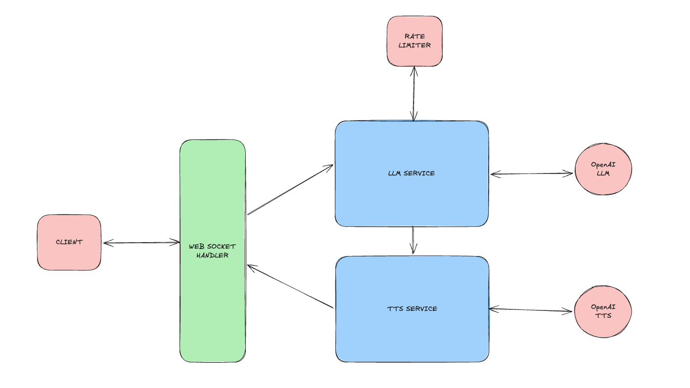

## Engineered-Arts Take Home assignment 

### Problem statement - 

    Creating a websocket server that will be able to take input of a text, process the text by making LLM calls to OpenAI API, convert the response into speech and send back to the client. 
#### High level flow based on problem statement: 

    Client → WebSocket message with text input → your service →
        1. send text to OpenAI LLM API

        2. receive text response

        3. send LLM text to OpenAI TTS API

        4. Sends audio back over WebSocket
    → Client

#### Proposed visual representation of data flow: 
